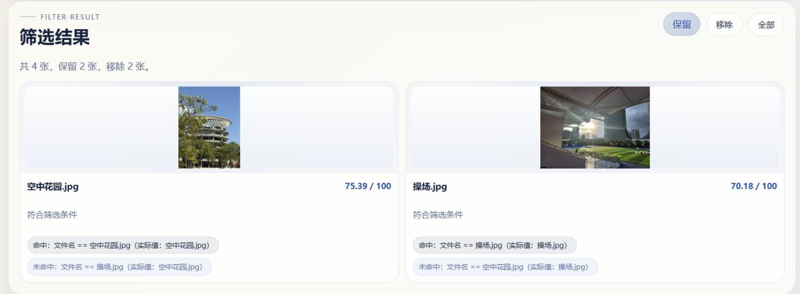
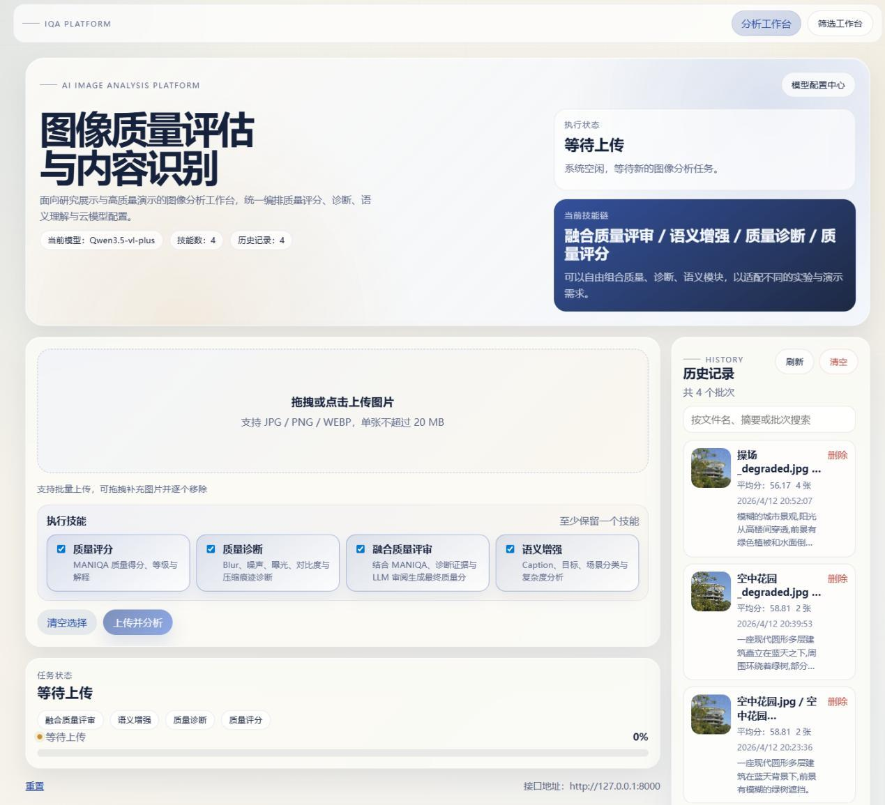
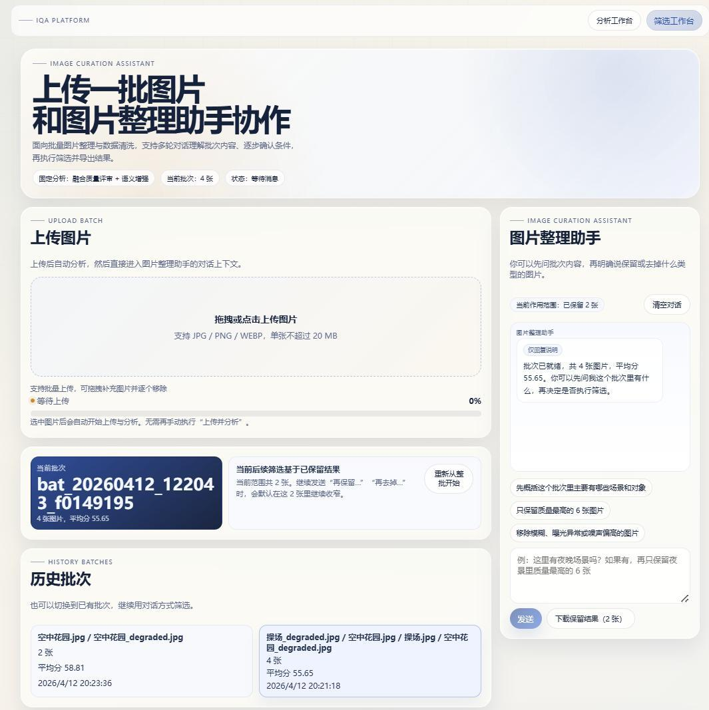
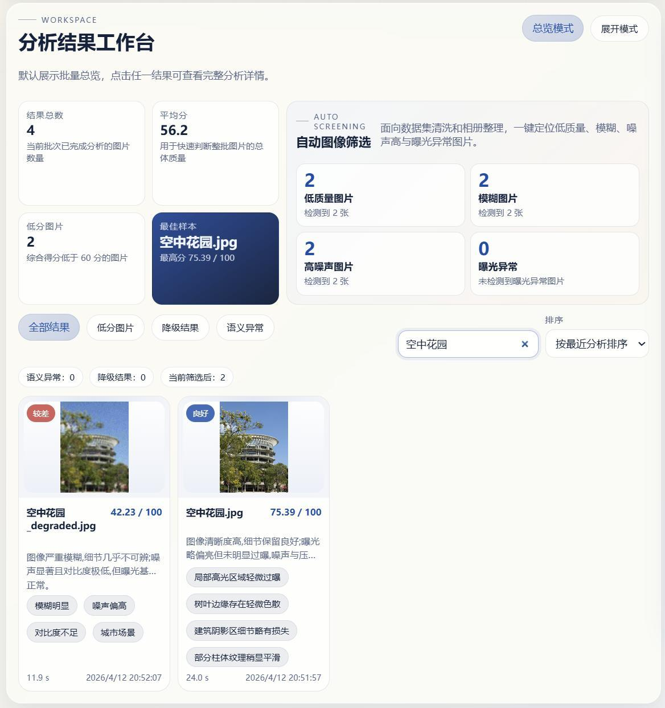

<div align="center">

# IQA Platform
### Image Quality Assessment & Semantic Analysis

A graduation project that turns image batches into quality scores, visual explanations, and reusable selections.

**React · FastAPI · PyTorch · MANIQA · Multimodal models · SQLite**

[Quick start](#quick-start) · [Screenshots](#screenshots) · [Architecture](docs/architecture.md) · [API](docs/api.md)

</div>



*From analysis to selection: a thesis demonstration retaining two images from a batch of four.*

## Overview

IQA Platform brings **image quality assessment, quality diagnostics, semantic understanding, and conversational filtering** into one web application. Upload a batch, inspect what makes an image usable, then refine your selection and export the images you want to keep.

Developed as an undergraduate graduation project, *Design and Implementation of an Intelligent Image Quality Perception and Semantic Content Analysis System*.

## What it does

| Capability | What you can do |
| --- | --- |
| **Quality assessment** | Score images without a reference image using a local MANIQA model, with scores displayed on a 0–100 scale. |
| **Quality diagnostics** | Inspect blur, noise, exposure, contrast, and compression artifacts through local image measurements. |
| **Quality fusion** | Review a combined score alongside its MANIQA, technical-evidence, and model-judge components. |
| **Semantic analysis** | Generate captions, object labels, scene categories, and complexity descriptors with a configured vision-language model. |
| **Conversational filtering** | Ask about a batch, refine selection criteria across turns, inspect keep/remove reasons, and export retained images as a ZIP. |
| **History and providers** | Reopen saved batches and switch between provider profiles through the configuration center. |

## Screenshots

<table>
<tr>
<td width="50%"><br><strong>Upload and analyze</strong><br>Select skills and inspect saved batches.</td>
<td width="50%"><br><strong>Discuss and refine</strong><br>Ask about a batch and narrow the retained selection.</td>
</tr>
</table>

<details>
<summary><strong>View detailed quality results</strong></summary>



The results workspace combines batch statistics, diagnostic categories, scores, and image-level explanations.

</details>

These are actual application screenshots extracted from the graduation thesis. The interface and generated explanations shown are in Chinese; the project documentation is in English. See [figure sources](docs/assets/README.md).

## How it works

1. **Upload** JPEG, PNG, or WebP images. The backend validates files, saves originals, and creates working images and thumbnails.
2. **Analyze** with selectable skills. Independent skills run concurrently; dependent stages consume their outputs.
3. **Inspect** scores, diagnostics, semantic information, and warnings in the results workspace.
4. **Refine** the current batch through conversation. The filtering assistant produces structured rules that the backend executes against analysis results.
5. **Export or revisit** the selection, or reopen the batch from local history.

MANIQA inference and low-level diagnostics run locally. When configured, external providers receive images and prompts for semantic analysis, quality explanations, model judging, and visual inspection. The application is intended for local use and does not include user authentication.

## Quick start

### Prerequisites

- Python 3.10 or 3.11 for the project's pinned PyTorch stack.
- Node.js 18+ and npm for the Vite 5 frontend.
- The **MANIQA PIPAL checkpoint**, placed at:
  `backend/iqa/models/MANIQA_PIPAL-ae6d356b.pth`.
- A vision-capable provider profile for the full analysis and conversational workflow.

Weights are distributed separately. See [setup and checkpoint instructions](docs/setup.md) before starting the backend.

### 1. Set up the backend

Run from the repository root on macOS or Linux:

```bash
git clone https://github.com/Gaviinnn/IQA_website.git
cd IQA_website
python3 -m venv .venv
source .venv/bin/activate
python -m pip install -r backend/requirements.txt
cp .env.example .env
```

On Windows PowerShell, use `python -m venv .venv`, activate with `.\.venv\Scripts\Activate.ps1`, and copy the configuration with `Copy-Item .env.example .env`.

After placing the checkpoint, start the API:

```bash
python -m uvicorn backend.main:app --reload --host 127.0.0.1
```

### 2. Start the frontend

In a second terminal, from the repository root:

```bash
cd frontend
npm ci
npm run dev -- --host 127.0.0.1
```

Open **[http://127.0.0.1:5173](http://127.0.0.1:5173)**. Backend endpoints: [health](http://127.0.0.1:8000/health) · [interactive API reference](http://127.0.0.1:8000/docs).

### 3. Configure a provider and analyze

Open the **Provider configuration center** (`模型配置中心`), select a preset, supply your endpoint, model, and API key, then save, test, and activate the profile. Use a model that accepts images.

Upload a small batch and select the analysis skills you want. Without a configured provider, local MANIQA scoring and diagnostics remain available, while provider-dependent outputs may be unavailable or fall back. See [setup and troubleshooting](docs/setup.md).

## Project structure

```text
backend/
  routes/                Upload, analysis, history, filtering, and provider APIs
  services/              Skill pipeline, diagnostics, filtering, and persistence
  iqa/models/            Local MANIQA integration
  models/                Multimodal provider gateway
  tests/                 Filtering logic regression tests
frontend/
  src/pages/             Analysis and filtering workspaces
  src/components/        Upload, results, history, and provider controls
scripts/                 Optional workflow benchmark
docs/                    Setup, architecture, API, and design notes
  assets/                Selected thesis screenshots
```

## Documentation

- [Setup](docs/setup.md) — dependencies, model weights, configuration, and troubleshooting.
- [Architecture](docs/architecture.md) — module responsibilities, skill dependencies, and data flow.
- [API reference](docs/api.md) — implemented endpoints and request examples.
- [Quality scoring](docs/quality-scoring.md) — score components, weights, and interpretation.
- [Conversational filtering](docs/filtering.md) — batch scope, rule execution, and exports.
- [Development](docs/development.md) — checks and optional benchmark prerequisites.

## Checks

```bash
python -m unittest discover -s backend/tests -v
cd frontend
npm ci
npm run build
```

The backend tests cover filtering logic and use stubs for external services. A complete model run additionally requires the checkpoint and provider configuration.

## Data and project scope

Uploads, local databases, logs, model checkpoints, benchmark corpora, and personal thesis materials are excluded from version control. Provider credentials are stored in the local SQLite database; keep it private. See [local data handling](docs/setup.md#local-data-and-privacy).

This is a graduation-project implementation. Fusion weights and diagnostic thresholds are engineering heuristics, and the screenshots illustrate sample outputs rather than a validated quality benchmark.

## Acknowledgments

The quality assessment component builds on [MANIQA](https://github.com/IIGROUP/MANIQA) and [IQA-PyTorch / pyiqa](https://github.com/chaofengc/IQA-PyTorch). Refer to those projects for their research, model weights, and applicable terms.
