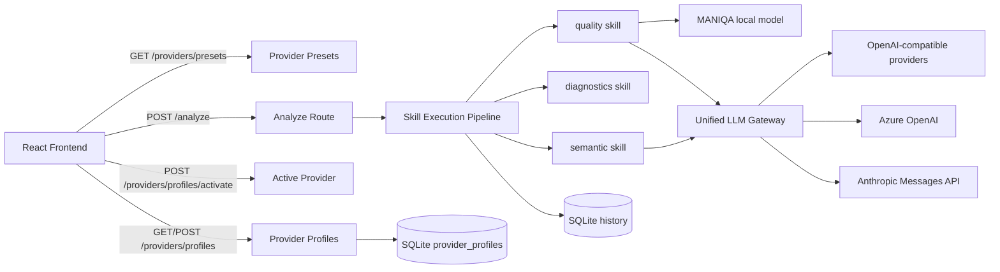

# AI Image Analysis Platform - Architecture (v2.1)

## Summary

The system now has two layers of extensibility:

- skill-based image analysis
- provider-based cloud model configuration

This upgrades the project from a fixed `MANIQA + Doubao` application to a configurable multimodal analysis platform.

## Current analysis skills

- `quality`: MANIQA quality scoring
- `diagnostics`: blur, noise, exposure, contrast, compression diagnostics
- `semantic`: caption, object list, scene type, object count, semantic complexity

## Current provider architecture

## Main backend modules

- [`provider_profiles.py`](d:\python\Project\IQA_website\backend\services\provider_profiles.py): vendor presets, profile persistence, active profile management
- [`providers.py`](d:\python\Project\IQA_website\backend\routes\providers.py): provider configuration APIs
- [`doubao_api.py`](d:\python\Project\IQA_website\backend\models\doubao_api.py): unified LLM gateway for provider routing, structured parsing, and connectivity checks
- [`analyze_service.py`](d:\python\Project\IQA_website\backend\services\analyze_service.py): skill pipeline orchestration
- [`skill_registry.py`](d:\python\Project\IQA_website\backend\services\skill_registry.py): skill registration and canonical order
- [`skill_semantic.py`](d:\python\Project\IQA_website\backend\services\skill_semantic.py): semantic analysis using the active provider
- [`maniqa_service.py`](d:\python\Project\IQA_website\backend\iqa\models\maniqa_service.py): MANIQA scoring + provider-backed explanation generation

## Supported provider categories

### 1. OpenAI-compatible providers

These use the OpenAI SDK with custom `base_url` and `api_key`:

- OpenAI
- Google Gemini OpenAI-compatible endpoint
- Alibaba Qwen
- Volcengine Ark / Doubao
- DeepSeek
- OpenRouter
- xAI Grok
- Zhipu GLM
- Baidu Qianfan
- Tencent Hunyuan
- Moonshot Kimi
- MiniMax

### 2. Azure OpenAI

Uses `AsyncAzureOpenAI` and supports:

- resource endpoint
- deployment/model name
- API version

### 3. Anthropic Claude

Uses the official Messages API request format through `httpx`, including image blocks for multimodal input.

## Frontend configuration module

The frontend now includes a provider configuration center:

- select a vendor preset
- edit base URL, model, API key, API version, region, organization
- save multiple provider profiles
- activate one profile globally
- test provider connectivity

Key frontend files:

- [`ProviderPanel.jsx`](d:\python\Project\IQA_website\frontend\src\components\ProviderPanel.jsx)
- [`Home.jsx`](d:\python\Project\IQA_website\frontend\src\pages\Home.jsx)
- [`api.js`](d:\python\Project\IQA_website\frontend\src\utils\api.js)

## Design value

This version supports stronger system-level claims in a paper:

- vendor-agnostic multimodal gateway
- dynamic provider configuration
- skill-based analysis pipeline
- configurable cloud model routing

## Official references used for compatibility design

- OpenAI API reference: https://platform.openai.com/docs/api-reference
- Azure OpenAI reference: https://learn.microsoft.com/azure/ai-services/openai/reference
- Anthropic Messages API: https://docs.anthropic.com/en/api/messages
- Gemini OpenAI-compatible endpoint: https://ai.google.dev/gemini-api/docs/openai
- Alibaba DashScope OpenAI compatibility: https://www.alibabacloud.com/help/en/model-studio/compatibility-of-openai-with-dashscope
- Volcengine Ark OpenAI SDK access: https://www.volcengine.com/docs/82379/1298454
