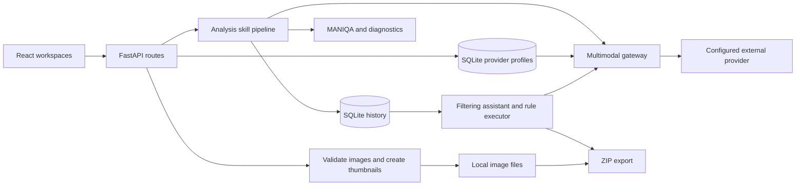

# Architecture

[Back to the project](../README.md)

## System boundaries

The React frontend calls a FastAPI backend. The backend stores images on disk and history plus provider profiles in SQLite. Local scoring and diagnostics are combined with optional external model requests.

## Analysis pipeline

[skill_registry.py](../backend/services/skill_registry.py) registers six skills; four are exposed in the UI.

| Skill | Responsibility | Dependencies |
| --- | --- | --- |
| `quality` | MANIQA score and provider-backed explanation | None |
| `diagnostics` | Local image-quality measurements | None |
| `quality_evidence` | Convert diagnostics into technical scores | `quality`, `diagnostics` |
| `quality_judge` | Ask a model to assess quality using image and evidence | `quality_evidence` |
| `quality_fusion` | Combine MANIQA, technical evidence, and judge score | All preceding quality stages |
| `semantic` | Captions, objects, scene and complexity | None |

The default requested set is `quality`, `diagnostics`, `quality_fusion`, and `semantic`. Dependencies are expanded automatically. [analyze_service.py](../backend/services/analyze_service.py) builds dependency stages, executes independent skills concurrently, and stores each outcome in a shared context.

Each image result includes model identifiers, per-skill status and duration, warnings, a request ID, and a batch ID. Failure in one skill is recorded so other results can still be returned; callers must inspect degraded output.

## Module map

| Module | Responsibility |
| --- | --- |
| [main.py](../backend/main.py) | Application setup, middleware, routes, health, logs, and static uploads |
| [uploads.py](../backend/services/uploads.py) | Validation, originals, working images, thumbnails, and metadata |
| [maniqa_service.py](../backend/iqa/models/maniqa_service.py) | Local model loading and serialized MANIQA inference |
| [doubao_api.py](../backend/models/doubao_api.py) | Shared provider gateway, despite its historical filename |
| [provider_profiles.py](../backend/services/provider_profiles.py) | Presets, stored profiles, active selection, and environment bootstrap |
| [history_service_sqlite.py](../backend/services/history_service_sqlite.py) | Batch history, search, retention, and deletion |
| [filtering_agent.py](../backend/services/filtering_agent.py) | Conversation, inspection tools, and structured filtering plans |
| [filtering_executor.py](../backend/services/filtering_executor.py) | Rule normalization, evaluation, sorting, and selection reasons |
| [Home.jsx](../frontend/src/pages/Home.jsx) | Analysis and history workspace |
| [FilterStudio.jsx](../frontend/src/pages/FilterStudio.jsx) | Conversational filtering workspace |
| [ProviderPanel.jsx](../frontend/src/components/ProviderPanel.jsx) | Provider configuration center |

See [quality scoring](quality-scoring.md), [filtering](filtering.md), and [API contracts](api.md) for the details. Storage and external-data behavior are documented in [setup](setup.md#local-data-and-privacy).
